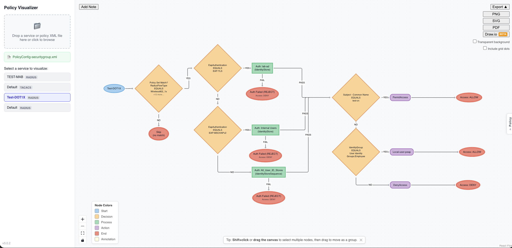

# Policy Visualizer

Policy Visualizer converts a network policy XML service export into:

- a normalized policy model,
- a compiled decision-flow graph,
- and an interactive browser diagram.

It also supports CLI rendering to static diagram formats for offline/scripted workflows.



## What it does

- Parses ClearPass service export XML (RADIUS + TACACS)
- Normalizes policy conditions into canonical Boolean expressions
- Builds deterministic Policy IR and Flow IR
- Serves Flow IR from a FastAPI backend
- Renders an interactive flow diagram in a React Flow frontend
- Supports static SVG/PNG/PDF generation through a CLI path

## Tech Stack

- **Backend/API:** FastAPI, defusedxml
- **Compiler pipeline:** Python (`src/parser.py`, `src/normalizer.py`, `src/policy_ir.py`, `src/flow_ir.py`)
- **Frontend:** React + Vite + React Flow + Dagre
- **Static rendering:** Graphviz
- **Packaging:** Docker + docker-compose

## Prerequisites

### Option A (recommended): Docker

- Docker Desktop with Compose support

### Option B: Local development

- Python 3.11+
- Node.js 20+
- Graphviz installed and on PATH (for CLI static rendering)

## Run with Docker

From repository root:

```bash
docker compose up --build
```

Services:

- Frontend: http://localhost:80
- API: http://localhost:8000
- API health: http://localhost:8000/api/health

## Run locally (without Docker)

### 1) Backend/API

From repository root:

```bash
python -m venv .venv
source .venv/bin/activate
pip install -r requirements.txt
uvicorn api.main:app --reload --host 0.0.0.0 --port 8000
```

### 2) Frontend

In a separate terminal:

```bash
cd frontend
npm install
npm run dev
```

Default frontend dev URL: http://localhost:5173

## CLI usage (static diagram generation)

From repository root:

```bash
python -m src.cli path/to/service.xml --output diagram.svg
```

Examples:

```bash
# List services in XML
python -m src.cli path/to/service.xml --list-services

# Render specific service
python -m src.cli path/to/service.xml --service "My Service Name" --output diagram.svg

# Render PNG/PDF
python -m src.cli path/to/service.xml --output diagram.png --format png
python -m src.cli path/to/service.xml --output diagram.pdf --format pdf
```

## API endpoints

- `GET /api/health` — liveness check
- `POST /api/services` — upload XML and list services
- `POST /api/flow` — upload XML and compile selected/default service to Flow IR

The maximum upload size is **10 MB**; files larger than this return HTTP `413`. Other error statuses: `415` (wrong extension), `422` (invalid XML structure or no services found), `500` (processing error). Unresolved object references are soft-failed — the API returns HTTP `200` with a `warnings` array in the response.

## Test suite

From repository root:

```bash
.venv/bin/pytest tests/
```

## Project structure (high level)

- `src/` — parser, normalizer, policy IR, flow IR, renderer, CLI
- `api/` — FastAPI app and routes
- `frontend/` — React app and diagram components
- `tests/` — parser/normalizer/policy/flow/API tests and fixtures
- `docs/` — release map and release notes

## Notes

- The app is deterministic by design: same XML input should produce the same compiled graph structure.
- Current workflow is upload/view-only (no policy editing UI).
